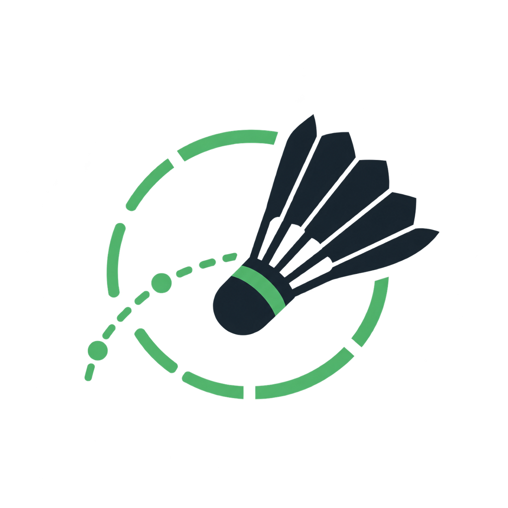

<p align="center">
  
</p>

<h1 align="center">Smart Badminton</h1>

<p align="center">Keep the rallies. Cut the waiting. See your game differently.</p>

<p align="center">
  <strong>English</strong> | <a href="README.zh-CN.md" lang="zh-CN">简体中文</a>
</p>

<p align="center">
  <a href="https://smart-badminton-tau.vercel.app/">Web App</a> ·
  <a href="#start-with-a-match">Quick Start</a> ·
  <a href="docs/studio-tutorial.en.md">Studio Guide</a> ·
  <a href="https://github.com/TempestShaw/Smart-Badminton/releases">Releases</a>
</p>

<p align="center">
  <a href="https://github.com/TempestShaw/Smart-Badminton/actions/workflows/ci.yml"></a>
  
  <a href="LICENSE"></a>
</p>

Smart Badminton turns fixed-camera badminton recordings into rally highlights. Find candidate rallies, refine their boundaries, and export the moments you want to watch again. Your video stays on your device during browser editing and local analysis.

## Start with a match

[Open the web app](https://smart-badminton-tau.vercel.app/) and choose **Browser Quick**:

1. Choose a match video from your device.
2. Run **Quick analysis** to find candidate rallies.
3. Review the clips and adjust their start and end times.
4. Click **Export MP4** to save your edit.

No installation or account is needed for Browser Quick. It uses lightweight visual activity analysis and FFmpeg WebAssembly; exports currently accept source files up to 1.5 GB. Use Native Pro for larger recordings or full pose, trajectory and score analysis.

Both editions support English and Chinese, automatically select a supported browser language on first use, and remember manual language and light/dark mode choices.

## Why use Smart Badminton?

- **Spend less time finding the action.** Start from candidate rally boundaries instead of scrubbing through every pickup and pause.
- **Keep control of every cut.** Review the final shot, drag clip edges, nudge by a frame, split clips, and undo changes. Automatic output is a draft you can correct.
- **Keep analysis close to your footage.** Browser Quick processes videos in the browser. Native Pro runs the Python pipeline on your own computer and renders from the original recording.

## Choose your edition

| | Browser Quick | Native Pro |
| --- | --- | --- |
| Start here | [Open the web app](https://smart-badminton-tau.vercel.app/) | Install and run local Studio |
| Rally detection | Lightweight visual activity analysis | Calibrated multimodal pipeline |
| Editing | Clip boundaries, split/add/delete, local timeline save | Detailed timeline, frame nudging, undo/redo, cut preview |
| Analysis | Candidate rally segments | Hybrid shuttle tracking, player pose and evidence-based scoring |
| Export | MP4 through browser WebAssembly | Source-quality rendering through local FFmpeg |
| Setup | No installation | Python; additional models and calibration for vision analysis |

Native Pro is a local companion. The hosted website opens the local Studio; it does not run the Python or CUDA pipeline in Vercel.

## Use Native Pro on your computer

Requires Python 3.10 or later. Install from the repository to get the latest interface and bilingual support:

```bash
git clone https://github.com/TempestShaw/Smart-Badminton.git
cd Smart-Badminton
python -m venv .venv
source .venv/bin/activate
python -m pip install -e ".[studio]"
```

On Windows, activate the environment with `.venv\Scripts\activate` instead.

Open a folder containing your own recordings:

```bash
smart-badminton studio --library /path/to/matches
```

Studio opens at [127.0.0.1:8765](http://127.0.0.1:8765). Choose a video and output location, edit the timeline, and save before exporting. The base Studio installation supports manual editing; automatic vision features require their dependencies, models and court calibration.

Add the full vision stack when you need it:

```bash
python -m pip install -e ".[full]"
smart-badminton install-models --directory models
```

In Studio, outline the active court, generate and refine the helper regions, and save calibration before running analysis. CUDA is optional; CPU vision analysis is supported but slower. See the [Studio guide](docs/studio-tutorial.en.md) and [model setup](models/README.md).

[Releases](https://github.com/TempestShaw/Smart-Badminton/releases) also provide a Python wheel and a separate offline model bundle. Tagged releases can lag behind `main`.

## Use directly in your terminal

A reviewed timeline is a small CSV file. Save this illustrative example as `rallies.csv` and use a recording long enough to contain these ranges:

```csv
rally,start_seconds,end_seconds
1,2.600,8.750
2,11.770,25.800
```

Render only those intervals from your own video:

```bash
smart-badminton render --video match.mp4 --rallies rallies.csv --output highlights.mp4
```

The CLI also exposes feature extraction, rally prediction, shuttle tracking, score analysis and model training as separate commands. See the [command reference](smart_badminton/README.md) and [advanced workflows](docs/advanced-workflows.md).

## Explore and contribute

- [Studio guide in English](docs/studio-tutorial.en.md) and [简体中文](docs/studio-tutorial.zh-CN.md).
- [Architecture](docs/architecture.md), [local Studio API](docs/studio-api.md), and [web deployment](docs/deployment.md).
- [Model card](models/MODEL_CARD.md), [model setup](models/README.md), and [advanced research workflows](docs/advanced-workflows.md).
- [Synthetic example project](examples/privacy_safe_sample) with metadata and annotations, without recorded people, venue footage or audio.
- [Report a problem](https://github.com/TempestShaw/Smart-Badminton/issues/new). Include your edition, operating system, reproduction steps and error message. Leave out credentials and private recordings.

For frontend development and checks:

```bash
cd studio-web
npm ci
npm run dev
```

Open [localhost:3000/?engine=browser](http://localhost:3000/?engine=browser). Run `npm run check`, `npm test`, and `npm run build` before submitting UI changes. `npm run build:embedded` updates the frontend served by local Studio. CI also tests Python 3.10 and 3.12 and builds the Python wheel.

Keep the English and Chinese READMEs aligned when changing setup or capabilities.

## Trust and license

This is an early research release. Check rally endings and validate on representative footage before unattended batch processing. Missing evidence should remain unknown; trajectories, scores and exploratory motion statistics are not guaranteed ground truth.

Normal browser editing and native analysis use local footage. Optional multimodal score labeling sends selected evidence to your configured model service and requires separate credentials; see the [Studio guide](docs/studio-tutorial.en.md#9-motion-statistics-and-scoring).

The source code and published rally-state model use [Apache-2.0](LICENSE). The full vision bundle also contains AGPL-3.0 and MIT components with their own license terms. Model files have checksum-bound license sidecars. See [third-party notices](THIRD_PARTY_NOTICES.md).
